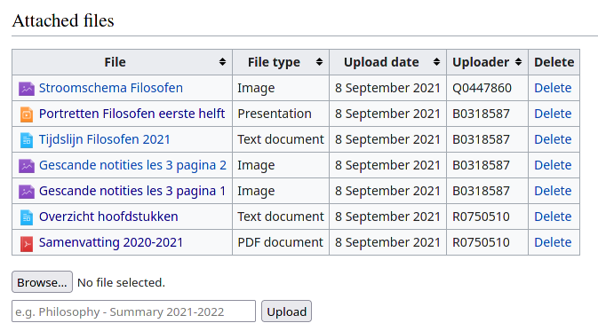

# AttachFiles
This extension allows users to upload and attach files directly to pages, without going through the default MediaWiki upload process. Made for ULYSSIS VZW by Joachim Vandersmissen.

## Features
* Very user-friendly UI.
* Automatically shows a table of attached files, no parser commands or special configuration required.
* Sort by name, file type, upload date, and uploader.
* Upload and delete files directly on an article page.
* Support for MediaWiki `upload` and `delete` permissions.
* Multiple files with the same name are supported (attached to different pages).
* Files uploaded using AttachFiles are stored using the default MediaWiki upload system: all files can be managed using the default MediaWiki interface and uploaded files are internally linked to the correct page. In particular, AttachFiles works seamlessly with the MediaWiki protection system.
* Works with other extensions such as [CompressUploads](https://github.com/ULYSSIS-KUL/CompressUploads).



## Prerequisites
* Uploads need to be enabled. To do this, change the following setting in `LocalSettings.php` from false to true:
```
$wgEnableUploads = false; ==> $wgEnableUploads = true;
```
* If you want to allow general documents such as `.pdf` or `.docx`, add the folowing settings to `LocalSettings.php`:
```
$wgFileExtensions = array( 'png', 'gif', 'jpg', 'jpeg', 'doc',
    'xls', 'mpp', 'pdf', 'ppt', 'tiff', 'bmp', 'docx', 'xlsx',
    'pptx', 'ps', 'odt', 'ods', 'odp', 'odg'
);
```
More information about upload permissions, settings and configuration is available on the official [MediaWiki documentation](https://www.mediawiki.org/wiki/Manual:Configuring_file_uploads#Configuring_file_types).

## Installation
* Download [the latest release](https://github.com/ULYSSIS-KUL/AttachFiles/releases/latest/download/AttachFiles.zip), and put the `AttachFiles` folder in the `extensions` directory.
* Add the following to `LocalSettings.php`:
```
wfLoadExtension( 'AttachFiles' );
```
* Run the maintenance update script to update the database. Go to your wiki directory (containing the `LocalSettings.php` file) and execute the following command:
```
php maintenance/update.php
```

## Configuration
As usual, configuration options can be added to `LocalSettings.php` using global variables.
| Option | Value | Default Value | Description |
| --- | --- | --- | --- |
| `$wgAFIgnoredPages` | `String[]` | `[]` | An array of pages which should be ignored by the extension (i.e. no table of attached files and no upload form is added). For example, ignore your main page by setting `$wgAFIgnoredPages[] = "Main Page";` in `LocalSettings.php` |

### Translations
Translations can be found in the `i18n` folder. Dutch (`nl.json`) and English (`en.json`) translations are already provided. Even the provided translations can be customized, and we strongly advise you to do so, in order to match them with your wiki situation.

Contributions (through PRs) are always welcome!

## Tips
* Check out [CompressUploads](https://github.com/ULYSSIS-KUL/CompressUploads) to reduce the amount of disk space used by your MediaWiki uploads.
